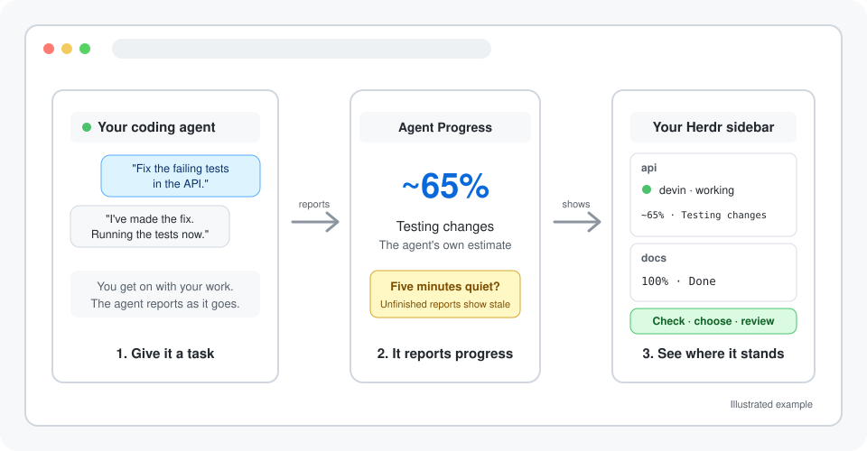

# Devin Agent Progress

> [!NOTE]
> This is a fork of [eliasstravik/herdr-agent-progress](https://github.com/eliasstravik/herdr-agent-progress), adapted exclusively for Devin CLI.

Agent-reported task progress for Devin CLI sessions in Herdr.

Devin Agent Progress adds estimates such as `~65% · Testing changes` beside Devin CLI sessions in Herdr's native agent sidebar. Reports stay local, unfinished reports become `stale` after five minutes, and completed work displays `100% · Done`.

<p align="center"></p>

## Supported target

- macOS
- Herdr 0.9.0 or newer
- Devin CLI with lifecycle hooks
- Herdr's official Devin integration

The adapter is intentionally Devin-only. It validates Herdr's `herdr:devin` native session identity and the live Devin process tree before accepting a report.

## Install from GitHub

```bash
herdr plugin install ricardo-devis-agullo/herdr-agent-progress
herdr integration install devin
herdr plugin action invoke configure --plugin agent-progress
```

Restart or resume Devin CLI after configuration, then give it a task and expand Herdr's agent sidebar.

Configure adds four hooks to `~/.config/devin/config.json` while preserving existing settings and comments:

```text
SessionStart
PostCompaction
PostToolUse
UserPromptSubmit
```

It also adds a dim `$agent_progress_summary` row to Herdr's sidebar configuration and starts the local publisher.

See [Getting started](docs/getting-started.md) for setup and troubleshooting.

## How it works

```text
Devin lifecycle hook
  verify native session and Devin launch
  inject bound reporting instructions

Devin CLI
  herdr-progress begin/report/clear

Local SQLite state
  task generation, estimate, activity, freshness

Publisher
  herdr pane report-metadata

Herdr sidebar
  ~65% · Testing changes
```

The percentage is Devin's estimate, not a timer or a tool count. It can move backwards when Devin discovers more work. Reporting failures do not stop the requested task.

Progress is stored in the plugin state directory and published through the local Herdr socket. No hosted progress service or additional API key is used.

See [Operations and development](docs/operations.md) for the command protocol, identity checks, state model, and verification commands.

## Check or remove

```bash
herdr plugin action invoke doctor --plugin agent-progress
herdr plugin log --plugin agent-progress
```

```bash
herdr plugin action invoke unconfigure --plugin agent-progress
herdr plugin unlink agent-progress
```

Unconfigure removes matching owned hooks and sidebar rows while preserving unrelated user edits. Local state and the stable launcher remain available for diagnostics.

## License

[MIT](LICENSE)
